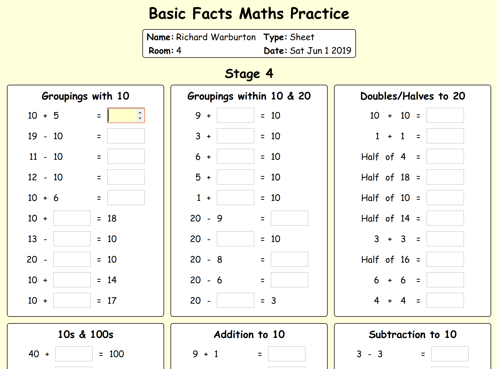
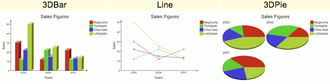

# Current Technologies

|Arena|List|
|---|---|
|Languages|Go, Dart, Javascript|
|Scripting|SVG, HTML5, CSS
|Platforms|AngularDart, Flutter, AppEngine|
|Storage|Google Cloud Storage, Google DataStore, SQLite3
|OSes|Ubuntu/Linux, Android, iOS|

# Past Technologies

|Arena|List|
|---|---|
|Languages|PHP, Lua, Rust, C, Java/Groovy, XSLT/XML|
|Scripting|XML, XHTML, FOP
|Platforms|ReactJS|
|Storage|MySQL, PostgreSQL
|OSes|Windows, OS X, OpenWRT, Fedora, Debian|
|Web Servers|Nginx, Apache, Lighttpd|
|DNS Servers|BIND, NSD|
|File Servers|Samba, Netatalk/AFP|

# Past Solutions

## DHCP4
https://github.com/krolaw/dhcp4 *Go*  
Open source DHCP IPv4 library.  I needed a Go native DHCP library for NuiNet/TrafficMate Pro, but there wasn't one available at the time.  The library was open sourced to benefit from community feedback. It was used by FaceBook in all of their datacentres for a time.

## Basic Facts
  

**Original:** *HTML/DOM, Javascript*  
**Cloud:** *Go, AppEngine, CloudStorage*  
Developed for New Zealand schools to match NZ maths standard tests.

## TriXOR

*Android Java, XML, SQLite3* 
Free Android puzzle game, similar to Set.  Downloadable from Google Android Market.

## XSLT Charts

<object alt="Charts Screenshot" type="image/svg+xml" src="images/icecream.svg"></object>

  

https://github.com/krolaw/charts *XML/XSLT, SVG*  
XML to Pie/Bar/Line chart converter.

## Free Subliminal Text
http://github.com/krolaw/fst *Java*  
  
Multiplatform programme that flashes subliminal messages on screen. Created when my wife's subliminal software failed, and later turned into a fully releasable product.

## Hearts
 *PHP, HTML, JavaScript, SVG*  
Hearts started with an interest in SVG and the imminent arrival of Valentine's day.  My wife blogged about it, which resulted in requests from SVG proponents to create a configurable version for general use.  A Canvas option was later added to support Android and iPhone devices.

## SipCloak
 *Go*  
Free, no registration, DNS controlled, SIP Redirection service. Sadly, no longer used as redirection isn't the best way to mask a SIP address.

# [Nui Software](https://nui.global) 

## MenuMate Enabler
*Groovy/ScriptMaster*   
Communications interface between Property Management product and 3rd Party Restaurant Software.

## PDF Addon
*Apache FOP, XSLT/XML*   
Provides PDF Statement generation for Property Management product.

## PBX Listener
*Groovy/ScriptMaster*  
IP PBX Systems interface plugin for Property Management product.

## Simple Charts

*Java, Javascript, HTML*
URI to Pie/Bar/Line chart converter. Was used in all major Skagerrak products before alternatives arrived.

## WebVault
**Original:** *Groovy/ScriptMaster, PHP, Apache*  
**Cloud:** *Groovy/ScriptMaster, Go, CloudStorage*  
Addon offsite backup system for MotelMate product.

## WebEdit
*AJAX, Javascript, HTML/DOM, PHP, MySQL, XML*  
  
An online, multilayer, drag and drop, web editor, aimed at school staff.

## Simple School Admin
*HTML, PHP, MySQL* 

   
 
A simple set of specially designed pages to assist operations.  Daysheet, bookings, problem logging, edit links and so forth.

## Stars of the Week
*Javascript, MySQL, PHP, SVG*  
  
  
Rotating stars put to good use.

