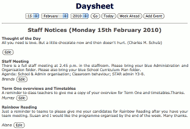

# _CTO / Architect / Developer_
# 2019 - Present : [Extraorder Limited](https://extraorder.app)

## Restaurant Ordering App

- [Google Play Link](https://play.google.com/store/apps/details?id=app.extraorder.extraorder_app)
- [AppStore Link](https://apps.apple.com/nz/app/extraorder/id1482743097)

Customer iOS, Android and Web App all leveraged the same [Flutter](https://flutter.dev/) codebase. The vendor admin web frontend utilised [AngularDart](https://angulardart.dev/) allowing a significant portion of the Flutter source to be reused. The backend was written in [Go](https://golang.org/), hosted on Google's [AppEngine](https://cloud.google.com/appengine) Standard platform with Datastore (config/menus) and CloudStorage (images). [Stripe](https://stripe.com/) for payments, [Mailgun](https://www.mailgun.com/) for emails and custom code to integrate with various POS systems. I also setup the dns hosting, mail forwarding, SIP phones etc. I was instrumental in creating the logo with some direction from the CEO. 

## Website

- [Original Site](https://krolaw.github.io/eowebsite/)

The initial Extraorder website used [Hugo](https://gohugo.io/), with the [Meghna theme](https://themes.gohugo.io/meghna-hugo/), hosted on [Github Pages](https://pages.github.com/). Alas, to keep dev workload sane, it was replaced by [WordPress](https://wordpress.com/) so a designer could manage the website.

# _Senior Developer / Dev Mentor / Software Architect_
# 2007 - 2019 : Skagerrak Software Limited trading as [Nui Software](https://nui.global)

## General I.T.

When I started, all services were in-house running off a single server. During my time I moved most services onto to separate low cost linux VPSes; and later where practical onto cloud systems. I setup and configured everything from Desktops (MacOS, Windows, Linux), Mail systems (Dovecot, SendMail, Postfix), Web Hosting (Apache, Nginx, MySQL, SQLite, PHP), SSL certificates, backup systems (rsync), VOIP phones/software (incl dialplans), routers, access points, printers, etc.

## eSchool Signup

ESchool Signup is an online extension of Nui's International Student Management application [eSchool](https://www.eschool.co.nz/). It allows international students (or their agents) to apply to study in New Zealand. Applications are later downloaded by each school's eSchool app. 

Each school has its own set of custom Go templates and config, uploaded from eSchool. As requirements changed, Signup's code stayed mostly static. Most changes and feature improvements were handled by updating the template and config upload. This allowed different schools their different requirements and their web designers to skin it if desired. This flexibility was intentional to keep development workloads under control and helped sell the product.

Signup started life as a Go App on a VPS backed by Sqlite and fronted by Nginx. Later it was moved to Google's AppEngine, backed by Datastore and CloudStorage.

## WebSync

WebSync connected Nui's customers' [MotelMate](https://nui.global/motelmate/), a FileMaker based Motel/Hotel Management desktop application, to online booking systems. It provided a consistent interface for MotelMate while translating for the many OTA's it connected to. 

Initially I wrote it as a Proof of Concept in Java and XSLT, running on an OSX server, with MySQL for storage. After a few years in production, I suggested rewriting and moving to cloud, avoiding downtime and load issues. I rewrote it Go and installed it on Google's AppEngine, utilising DataStore and CloudStorage. This meant we no longer needed to shutdown for OS upgrades or bother users when our Internet or SSD failed (rare but catastrophic for a critical service). Also, JSON was becoming more desirable than XML for communications, and XSLT was a unnecessarily cumbersome when dealing with complicated data transformations. Go made the whole process easier.

I also wrote a FileMaker XML export library, making it easier for MotelMate to download bookings.

## NuiNet / TrafficMate Pro / TrafficMate

NuiNet is a internet management solution I developed for the hospitality industry. It supported vouchers, and tariffs with auto renewing data, along with Paypal integration so guests could topup without staff intervention. I also wrote its [manual](https://nui.global/net/docs/configuration/).

It optionally integrated with Nui's MotelMate Property Management Software, allowing internet access to be seamlessly added at guest check-in.

I used [Voyager Linux](http://linux.voyage.hk/) on [PC Engines](https://www.pcengines.ch/) [APU2](https://www.pcengines.ch/apu2.htm) hardware (and [APU1](https://www.pcengines.ch/apu.htm) before it). The controlling application was written in [Go](https://golang.org), an all-in-one DHCP, DNS, Web server with account tracking. I added integration with Paypal using custom encrypted web buttons, not easy as PayPal only supported Java.

During development, I found that the IPTables netcounters were unreliable as they were not written for concurrency. I opted to use IPTable's ULOG (and later NFLOG) to send my Go app user traffic packet headers, which allowed effective monitoring.

Because we wanted control over DHCP allocation, I wrote a packet level [DHCP4 Go Library](https://github.com/krolaw/dhcp4). Nui kindy granted permission to open source the library, and I understand it was used by many other companies. At one point, it was used as part of [FaceBook's DHCP load balancing relay](https://github.com/facebookincubator/dhcplb/tree/7f3b3859478a4f19a15984d97c96fceaa89e982b) and installed in every one of their datacentres. It may have also been used at Google as I received patches from two Google employees.

By combining a [DNS library](https://github.com/miekg/dns) with the monitored connections, I was able to allow users to see exactly how their data was used. Due to privacy concerns, each device could only view its own logs (even if multiple devices shared the same account), and it was inaccessible to staff.

NuiNet would backup its settings and state daily to a VPS. If there was a hardware issue we could send out a box on overnight courier with user accounts intact and config ready to go.

In New Zealand there were concerns about users downloading illegal material with the account holder ultimately being legally responsible.
As such, I developed various antipiracy technologies that significantly thwarted users' ability to use torrenting technology. This was a major selling point prior to these new laws being tested.

In order to simplify setup, we ordered the hardware preassembled and had it shipped directly to the company that would laser etch our logo.
I customised a [Clonezilla](https://clonezilla.org/) USB drive, to load the onboard ssd on startup. This meant we could setup units without disassembly, or having to connect a keyboard or serial cable.

NuiNet would check in daily with a VPS for updates and allow vendors to apply them. Downtime was kept to a minimum as the system would continue running while downloading and applying the updates - then it would then close its listening sockets, startup the replacement process and exit.

TrafficMate was the forerunner to NuiNet using [OpenWRT](https://openwrt.org/) on a [Linksys WRT54GL router](https://en.wikipedia.org/wiki/Linksys_WRT54G_series).
It didn't have much ram or storage, but I was still able to implement and retrofit much of the antipiracy technology into it.

I wrote the controlling application in [Lua](https://www.lua.org/) including a basic HTTP1.0 webserver for the frontend from scratch.
IPTables was used for allocating access and data accounting.
STUNNEL was used to wrap the app with ssl, so that users could log in securely.

After 3 years, while I was proud with what could be done with the limited hardware, it was still limited, prompting me to look at other hardware options. 

## Rocket Drag and Drop Grid 
  

The Rocket Grid provided an editable view of bookings for a motel/hotel/park from within a web portal within the MotelMate desktop application. It used a red jogger for pixel perfect infinite scrolling. It was written in pure javascript, leveraging SVG to begin with and then the HTML DOM for increased compatibility.

The biggest complaints about previous grids was the waiting for them to load. With Rocket, the number of AJAX calls and the amount of data required for the initial load were significantly reduced. I wrote a background lookahead cache based on the direction of scrolling and several other optimisations to ensure it ran as smoothly as possible.

Years later, when MotelMate was being redeveloped for the cloud, I started reworking the code for an even faster, cleaner, better looking experience. Alas, I left Nui before it could be realised.

## Stats
Each month, motels were required to submit stats to the [Ministry of Statistics](https://www.stats.govt.nz/). This was usually a paper form. MotelMate would generate all the stats that the Motelier could then copy on to form. Early on, I wrote a PHP page (backed with MySQL), to receive the results and bundle them as a single CSV file, emailed monthly to a contact at the Ministry.

When the Ministry started development on their own API, they reached out. I provided feedback on initial design and developed the first client (in Go on AppEngine), allowing them to compare results with our CSV and realtime API. (I modified the PHP to also proxy the request to the Go client.) In the end we transitioned to just using the Go client.

## NSN/ELI Interface
In 2013 the [Ministry of Education](https://www.education.govt.nz/) (MOE) introduced a systems interface for obtaining National Student Numbers (NSI) and sending booking and attendance of children in Early Learning (ELI). It became a requirement that childcare/kindergarten services use software that supports NSI and ELI.

Due to its authentication and logging requirements, Nui's FileMaker based solution [FirstBase](https://nui.global/firstbase/) was not able to comply by itself. So, I designed and installed a Go server intermediary onto a VPS (NZ based as required by the MOE at the time) to fill the gaps.

## Simple Charts

*Java, Javascript, HTML*
URI to Pie/Bar/Line chart converter. Was used in all major Skagerrak products before alternatives arrived.

## Other developments 

- USB Cash Drawer Opener (Windows)
- Asterisk PBX Call Monitor (Windows/Mac)
- General IP PBX Monitor (Groovy)
- MenuMate POS Integration (Groovy)
- Xero OAuth web proxy
- Offsite backup system for MotelMate product (Groovy, Go)
- PDF export (XSLT, Java, Apache FOP)

## Publications

- 2015 - Tourism Business Magazine - [Loyalty schemes: What you need to know](publications/4-5_TB_Autumn15.pdf)

I was often used for proof reading in the office and assisted writing many articles promoting Nui's products.

# _I.T. School Technician / Server Admin / Developer / Trainer_
# 2001 - 2010 : [Prototec Ltd](https://www.prototec.co.nz)

During my final years at University I started contracting to primary schools as all-round I.T. support. 

I setup Linux servers with web hosting (Apache/PHP), mail (SendMail/Dovecot/SquirrelMail), filesharing (Netatalk/Samba), web proxy (Squid), web content filtering ([DansGuardian](https://en.wikipedia.org/wiki/DansGuardian)), DHCP (dhcpd), DNS (named), Backup (rsync/scp), Firewalls (IPTables). I was particularly proud when I figured out how to [NetBoot](https://en.wikipedia.org/wiki/NetBoot) NetRestore Macs from a Linux server.

I wrote custom web technologies for school use, including but not limited to:
School notice board, Room bookings, I.T. Issue Tracker, Drag and Drop WYSIWYG web editor and Maths Tester (See Prototec Learning).

    

I also advised on technology purchases, trained staff, made presentations, etc.

## Prototec Learning

https://learning.prototec.co.nz/

Developed for New Zealand schools to match NZ maths curriculum. Originally, I would charge a licence fee and allow schools to host it on their websites for students to practise at home.

Unfortunately I found that non-paying schools were linking to the paying schools' sites. So, I decided to host myself and make the whole thing free. Some minor advertising pays for its hosting and upkeep. Currently used by many schools around NZ.

  

**Original:** *HTML/DOM, Javascript*  
**Cloud:** *Go, AppEngine, DataStore*  

# _Teaching Assistant, Lab Tutor, Web (CGI) Developer_
# 1998 - 2001 : [University of Auckland Engineering Department](https://www.auckland.ac.nz/en/engineering/about-the-faculty/engineering-science.html)

I ran some of the labs for first year students, 

## Quizy
At the end of the each student lab, there was a survey form for students to fill out and the department wanted to make this an online electronic form. I developed a [CGI](https://en.wikipedia.org/wiki/Common_Gateway_Interface) application written in [C](https://en.wikipedia.org/wiki/C_(programming_language)), that read a text file with the desired questions (and additional information such as options for multichoice questions) and displayed it as a webpage for the students to fill out. It also saved the results into a file that could be used to collate results.

## ICACheat / Online Submission
At the time in the Engineering department, programming assignments were assessed by reading over source code in printed form. There were concerns that some students were not completing the work on their own. I visited the Computer Science Department, who already had their own systems for detecting suspicious similarities, to see if we could use some of their techniques to do the same. 

I ended up writing some [Visual Basic/VBA](https://en.wikipedia.org/wiki/Visual_Basic_for_Applications) in [Excel](https://en.wikipedia.org/wiki/Microsoft_Excel) to detect coding similarities with an adjustable threshold. However, we needed the assignments as text files for the programme to load. To solve this, I wrote an HTML upload form, with a Perl CGI backend to save the file. Along with printed code, students were required to upload their assignments using the web form. 

My memories of what happened next are filled with excitement and horror, followed by lots of student interviews.

# _Web Developer / Phone Support / Software Installer_
# 1996 - 1997 : NetGate Communications (early NZ ISP)

I was given a book on HTML 2.0 and asked to build a website. The user base was predominantly Mac users, and I assisted in helping users online with MacPPP (and later [FreePPP](https://en.wikipedia.org/wiki/FreePPP)). 

# _Computer Tutor_
# 1995 - 1997 Mac, 1993 - 1995 Amiga

During High School, I had an Commodore Amiga 500. I learnt various software packages and tutored them (I also wrote programmes in [Amiga Basic](https://en.wikipedia.org/wiki/AmigaBASIC) and [Lattice C](https://en.wikipedia.org/wiki/Lattice_C)). Later when I upgraded to an Apple Mac LC475, I switched over to tutoring that.

# Other

## TriXOR (2012)

- [Google Play](https://play.google.com/store/apps/details?id=prototec.TriXORFull&hl=en_US)

*Android Java, XML, SQLite3* 
Free Android puzzle game, similar to Set.  Downloadable from Google Android Market.

## XSLT Charts (2013)
*XML/XSLT, SVG*

- [Icecream Example](images/icecream.svg)
- [Sunspots Example](images/sunspots.svg)
  
XML to Pie/Bar/Line chart converter. Unfortunately, at some stage browsers stopped supporting the embedding of images into HMTL that were created using XSLT. Oddly they can still be viewed directly (links above).

## Free Subliminal Text (2011)
http://github.com/krolaw/fst *Java*  
  
Multiplatform programme that flashes subliminal messages on screen. Created when my wife's subliminal software failed, and later turned into something releasable.

## Hearts (2005)
 
*PHP, HTML, JavaScript, SVG*  
Hearts started with an interest in SVG and the imminent arrival of Valentine's day.  My wife blogged about it, which resulted in requests from SVG proponents to create a configurable version for general use.  A Canvas option was later added to support Android and iPhone devices.